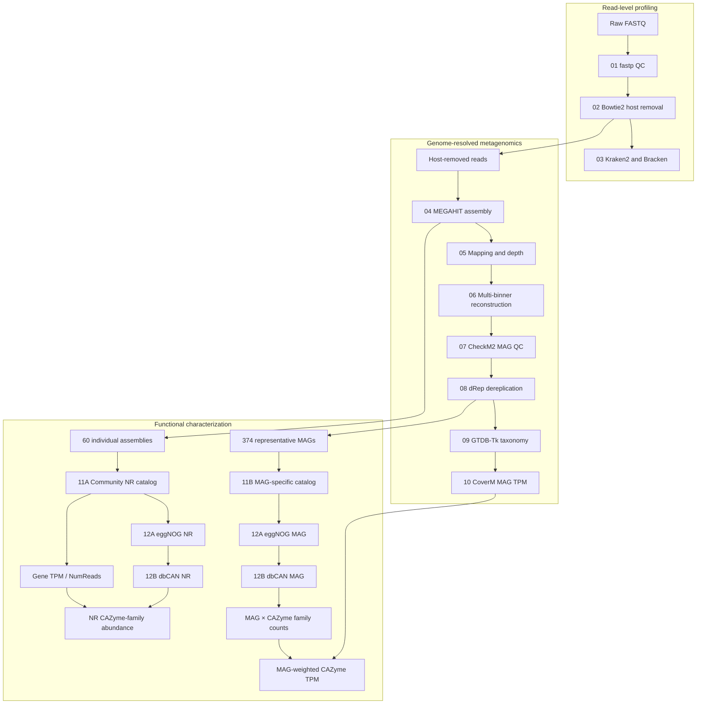

# Conceptual workflow

The diagram shows the verified relationships through Stage 12. Stage 13 remains pending.

Verified stage pages: [01](stages/01-fastp.md), [02](stages/02-dehost.md), [03](stages/03-taxonomy.md), [04](stages/04-assembly.md), [05](stages/05-mapping-depth.md), [06](stages/06-binning.md), [07](stages/07-checkm2.md), [08](stages/08-drep.md), [09](stages/09-gtdbtk.md), [10](stages/10-coverm.md), [11](stages/11-gene-catalog.md), and [12](stages/12-functional-annotation.md).
