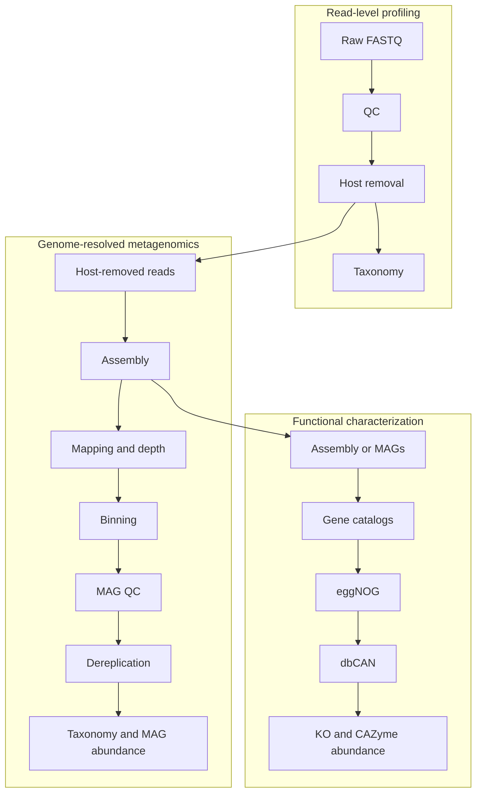

# Conceptual workflow

The diagram shows the intended relationships among workflow components. It does not specify implementations, commands, parameters, or methodological decisions.

```mermaid
flowchart TB
    accTitle: Conceptual metagenomics workflow
    accDescr: Three connected conceptual paths show read-level profiling, genome-resolved analysis, and functional characterization without implementation details.

    subgraph read_level ["Read-level profiling"]
        raw_fastq["Raw FASTQ"] --> qc["QC"] --> host_removal["Host removal"] --> taxonomy["Taxonomy"]
    end

    subgraph genome_resolved ["Genome-resolved metagenomics"]
        host_removed_reads["Host-removed reads"] --> assembly["Assembly"] --> mapping_depth["Mapping and depth"] --> binning["Binning"] --> mag_qc["MAG QC"] --> dereplication["Dereplication"] --> mag_taxonomy["Taxonomy and MAG abundance"]
    end

    subgraph functional ["Functional characterization"]
        assembly_mags["Assembly or MAGs"] --> gene_catalogs["Gene catalogs"] --> eggnog["eggNOG"] --> dbcan["dbCAN"] --> functional_abundance["KO and CAZyme abundance"]
    end

    host_removal --> host_removed_reads
    assembly --> assembly_mags
```
