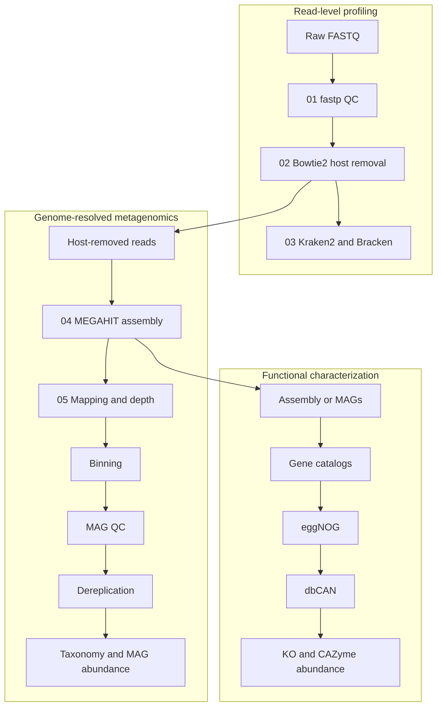

# Conceptual workflow

The diagram shows the workflow relationships. Stages 01–05 now have verified production documentation; downstream stages remain conceptual.

Verified stage pages: [01](stages/01-fastp.md), [02](stages/02-dehost.md), [03](stages/03-taxonomy.md), [04](stages/04-assembly.md), and [05](stages/05-mapping-depth.md).
